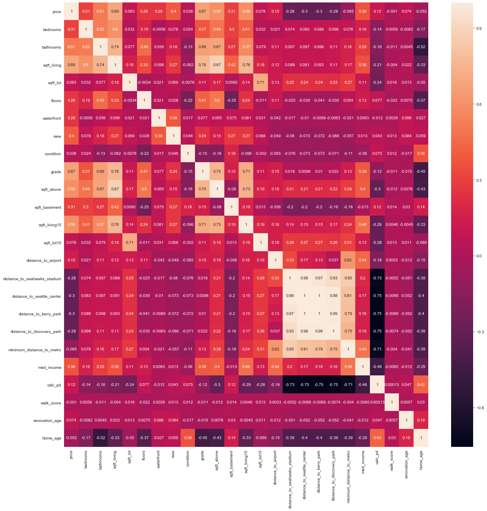
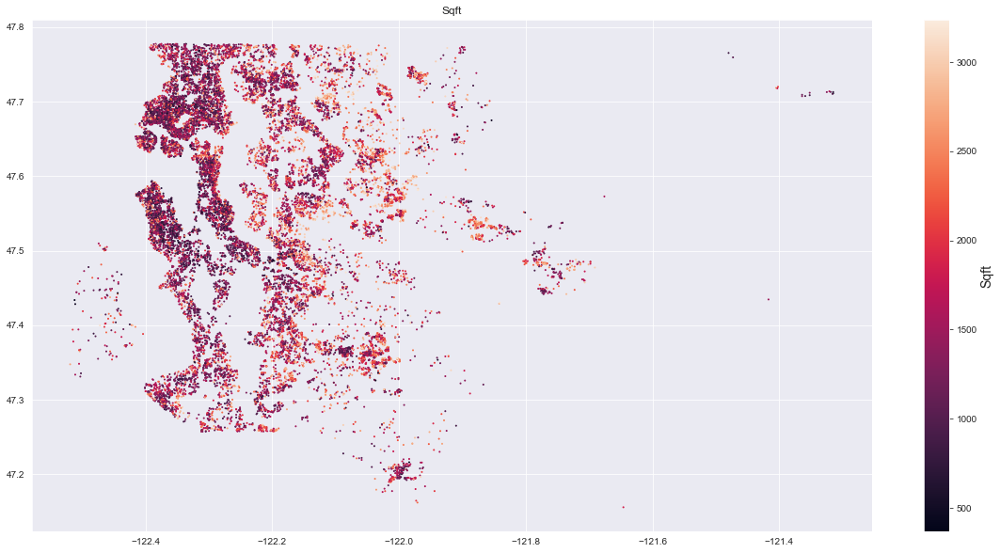
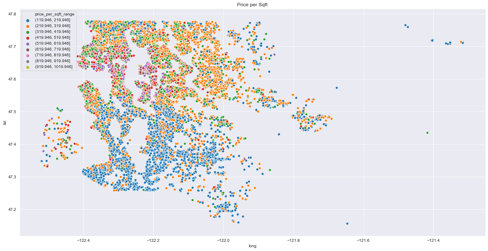
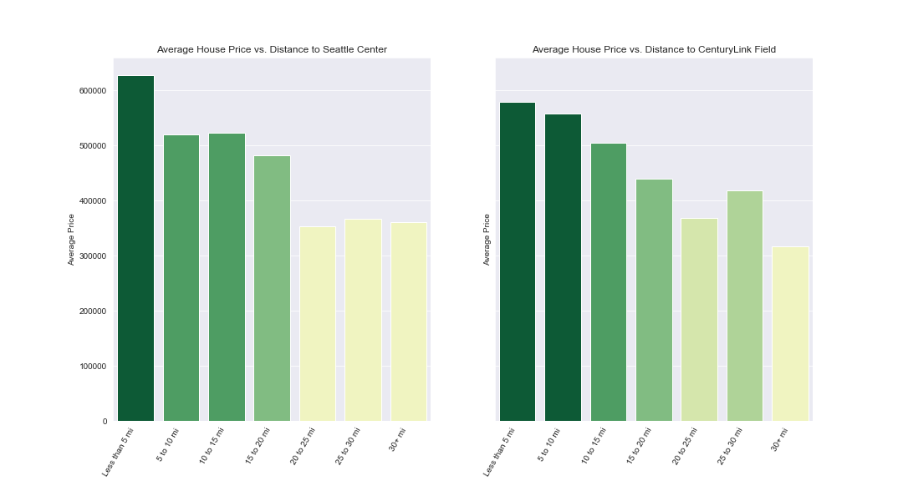
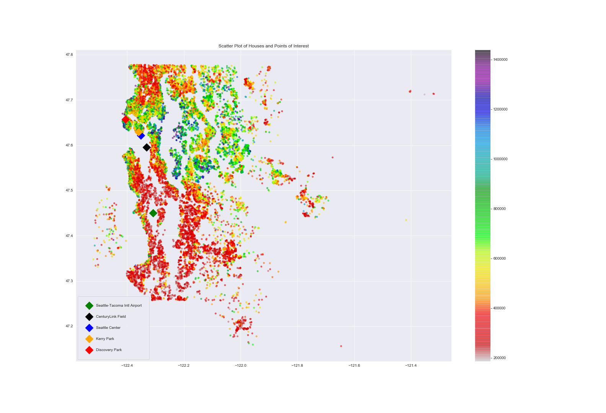

# King County's Housing Market

With the ongoing pandemic of COVID-19, interest rates for mortgages have dropped opening up more oppotunities, financially, for people to buy homes.  According to [Forbes](https://www.forbes.com/sites/forbesrealestatecouncil/2020/09/21/a-newfound-reality-buyers-currently-outnumber-sellers-in-housing-market/#7065905d339d), "buyers are currently outnumbering sellers [and] with so much demand and a low inventory, [seller]s are bound to make a quick sale and a higher profit."  Now is the time to act quickly to make profits in real estate, and if you're looking into the housing market in King County, WA, save time and maximize profits by searching armed with the information provided below.

## The Data

There are many characteristics of a home that affect its overall saleprice, but these characteristics individual to the home might not hold the same weights in different circumstances as seen in this chart of the data collected for the housing prices in King County below.

## What affects the sale price?

Out of the many factors that play into pricing a home, nothing stands out better than the natural tiers of housing price brackets that occur given a certain location.  These factors will be explored through the analysis of the followinf characteristics:  

* Price per Square-Foot
* Distances to Points of Interest
* Population Density

### Square Footage and House Price

Houses with larger living square footages should have a higher value. However, when considering other factors (especially location) square footage alone can't illustrate a concrete trend in housing prices.  In order to visualize the trends, square footage of homes will be viewed locationally which can then be juxtaposed with the price per square footage of homes locationally to observe any relationships within the data.

#### Square Foot Map
>
>* The plot above displays a trend where the concentrations of houses with lower living spaces towards the west of King County. 
    
#### Price Per Square Foot Map
>

>* Note how the price per squarefoot has a general trend of being the higher in the northern half of King County.

### How does proximity to different points of interest  in King County affect housing prices? 

In order to see how proximity to a point of interest affects housing prices we'll look at the average housing price within a certain interval. We'll use 5 mile intervals starting at 0 miles and ending at 30 miles. By looking at the average housing price in each interval we should see a trend similar to what was shown in the scatter plots above.

#### Organization/Code Cleanliness
>

>* The notebook should be well organized, easy to follow,  and code should be commented where appropriate.  
    * Level Up: The notebook contains well-formatted, professional looking markdown cells explaining any substantial code.

>
>* The notebook should be well organized, easy to follow,  and code should be commented where appropriate.  
    * Level Up: The notebook contains well-formatted, professional looking markdown cells explaining any substantial code.

>
>* The notebook should be well organized, easy to follow,  and code should be commented where appropriate.  
    * Level Up: The notebook contains well-formatted, professional looking markdown cells explaining any substantial code.
    
#### Overall points of Interest
asfd

>

>* The notebook should be well organized, easy to follow,  and code should be commented where appropriate.  
    * Level Up: The notebook contains well-formatted, professional looking markdown cells explaining any substantial code.

### Population Density

>

>* The notebook should be well organized, easy to follow,  and code should be commented where appropriate.  
    * Level Up: The notebook contains well-formatted, professional looking markdown cells explaining any substantial code.

## More Data

sdf

## Modelling the Data

 
 
## Conclusion

Location Matters!