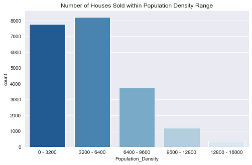
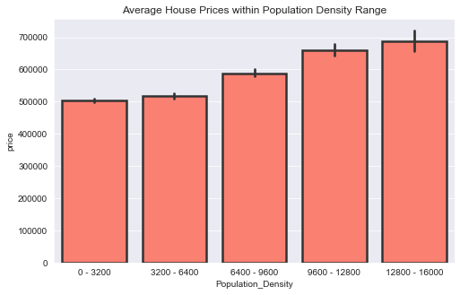
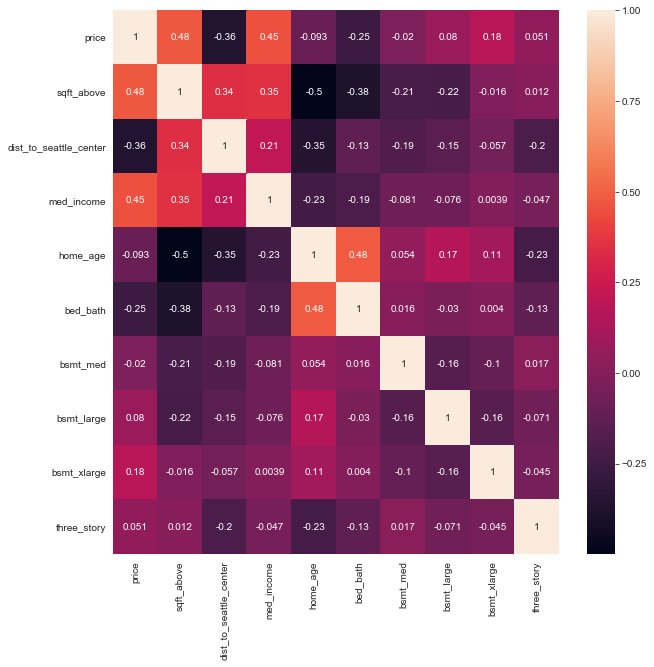
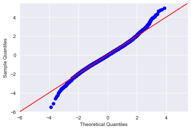
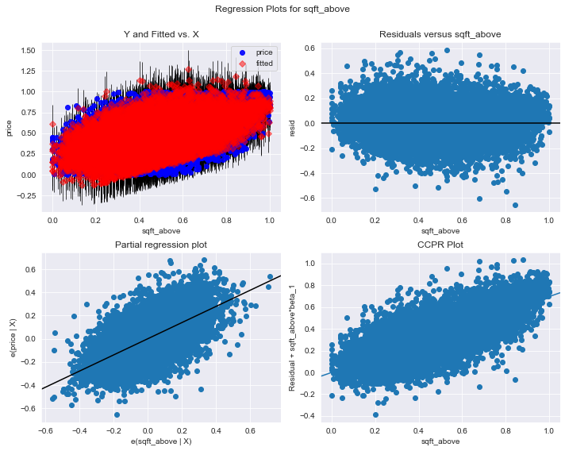

# King County's Housing Market

With the ongoing pandemic of COVID-19, interest rates for mortgages have dropped which opens up many financial opportunities for people to buy homes.  According to [Forbes](https://www.forbes.com/sites/forbesrealestatecouncil/2020/09/21/a-newfound-reality-buyers-currently-outnumber-sellers-in-housing-market/#7065905d339d), "buyers are currently outnumbering sellers [and] with so much demand and a low inventory, [seller]s are bound to make a quick sale and a higher profit."  Now is the time to act quickly to make profits in real estate, and if you're looking into the housing market in King County, WA, save time and maximize profits by searching armed with the information provided below.

## The Data

There are many factors that can affect a home's overall saleprice: from the individual characteristics of the property to the surrounding community in which the property is located.  But there is no single factor that can predict the sales price of a home; rather, it is the combination of the factors.  The data displayed in the heatmap below represents all the data gathered for King County's housing data from 2014-2015.

## What affects the sale price?

Out of the many factors that play into pricing a home in King County, the natural tiers and distinct patterns of price brackets that are created by the location of the houses seems to be the largest contributing factor to the price of a house.  The following factors will be explored through the analysis of the following characteristics in relation to the location of the house:  

* Price per Square-Foot
* Distances to Points of Interest
* Population Density

### Square Footage and House Price

Properties with larger square footages tend to hold a higher value.  However, when considering other factors (especially location) square footage alone can't illustrate a concrete trend in housing prices.  In order to visualize the trends, square footage of homes will be observed on the basis of longitude and latitude juxtaposed with its prices to obtain a better understanding of the relationship of square footage and house price.

#### Square Foot Map

> The plot above displays a trend where the concentrations of houses with lower square footage are highest in the west of King County. 
    
#### Price Per Square Foot Map

> Note how the price per squarefoot has a general trend of being the higher in the northern half of King County.

### How does proximity to different points of interest  in King County affect housing prices? 

In order to see how proximity to a point of interest affects housing prices, the average housing price within a certain interval will be observed: using 5 mile intervals starting at 0 miles and ending at 30 miles. By looking at the average housing price in each interval, trends will be better displayed.

#### Proximity to Transportation Centers

> Houses that are close to the airport have a lower average housing price.  This is likely due to the fact that noise from the air traffic negatively impacts the housing price. Houses that are 10 to 20 miles have the highest average price.  These houses are probably far away enough from the airport to not be significantly affected by noise but close enough that the commute to the airport is convenient.  Average housing price compared to distance to the nearest Link station is not as definitive.  Seattle does have an extensive road network and it may be the case that commuting by car is still commonplace enough within Seattle that proximity to a metro station is not the best indicator of housing price.

#### Proximity to Entertainment Centers

> Locations further away from either the Seattle Center or CenturyLink Field, the average housing price decreases. Houses less than 5 miles from Seattle Center are on average more expensive than houses within 5 miles of CenturyLink Field. This suggests that Seattle Center may be a more popular venue.

#### Proximity to Greenspace

> Proximity to a greenspace clearly has an effect on average housing price.  Discovery Park is the largest park in King County and Kerry Park offers an ideal view of the popular Space Needle and access to water.  Those houses that are more than 20 miles from either park are likely to fall within the southern or eastern part of King County.

#### Points of Interest

> The scatter plot above shows that houses closer to 4 out of the 5 points of interest we chose (Seattle Center, CenturyLink Field, Kerry Park, and Discovery Park) are more expensive. The houses closest to the airport are less expensive which confirms the results of the bar plot above. Kerry Park, Discovery Park, and Seattle Center seem to be locations where you can expect high housing prices. The scatter plot above is further proof that location is an important factor in determining the price of a home.

### Population Density

Parts of an area can be characterized from metropolitan to rural via population densities, but not all metropolitan areas will always have a higher housing prices in comparison to more rural areas. These trends are first observed when viewing the relationship between houses in certain population densities and their prices.  (Because the data was obtained by zipcode, the information is visualized categorically to avoid the nonlinearity of the relationship.)

#### Houses Sold by Population Density

> Notice in the plot above, how there is a higher volume of houses sold in the more rural areas of King County versus the more metropolitan areas.

#### Average Price of Houses Sold by Population Density

> The plot above displays (even without outliers) that the price of the average home increases as the density of the population surrounding the area increases.  When noting the deviations of each individual column, it also generally increases as the population density increases.

## More Data

> asdf

## Modelling the Data

>asdf

>asdf

 
## Conclusion

In King County, the locations of where you invest in real estate will greatly impact your profits.  If resources allow for large scale or even commericial investments, the areas closest to the metropolitan areas (North-west King County) are where you should invest your money.  If working with smaller resources or larger volumes of properties, invest in houses located in areas that are further away in the suburbs of King County.